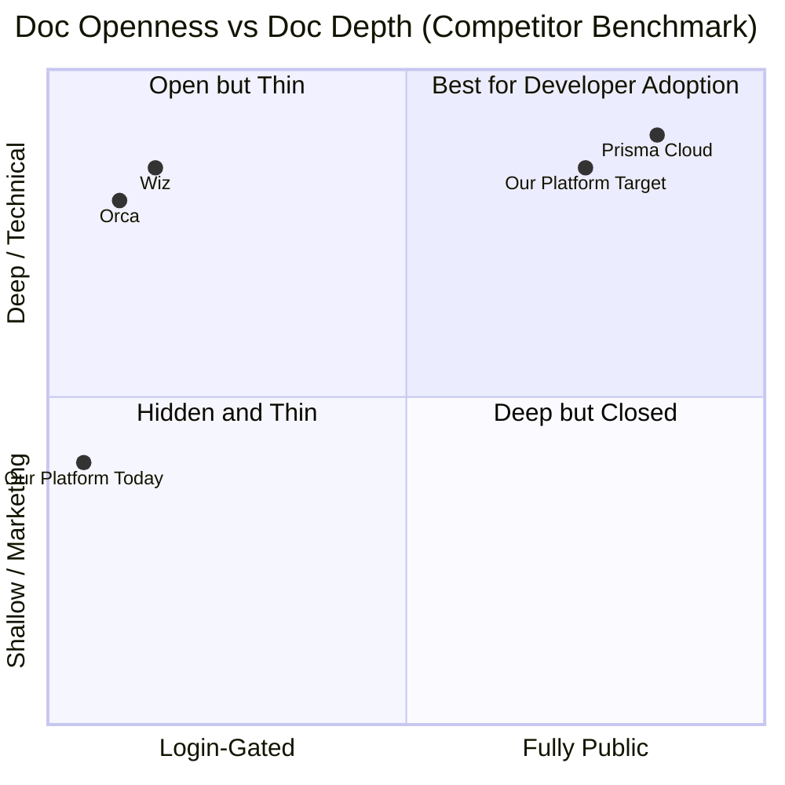
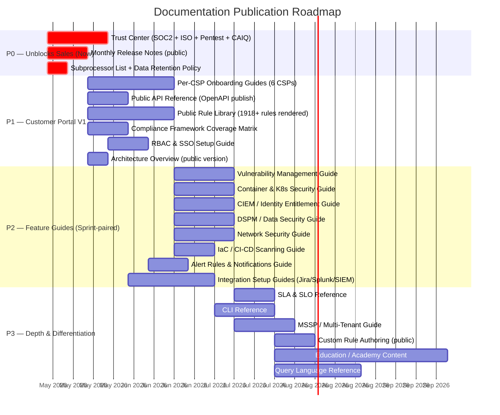
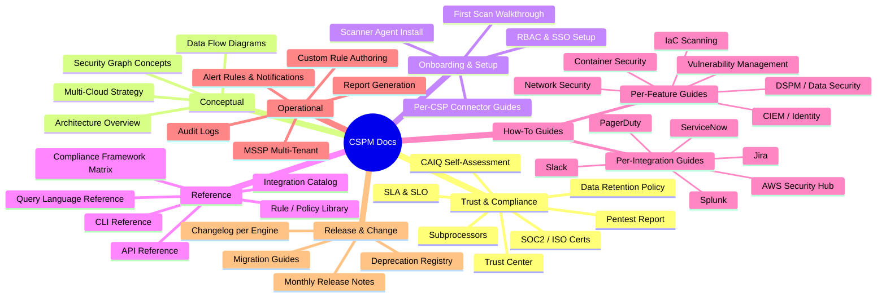
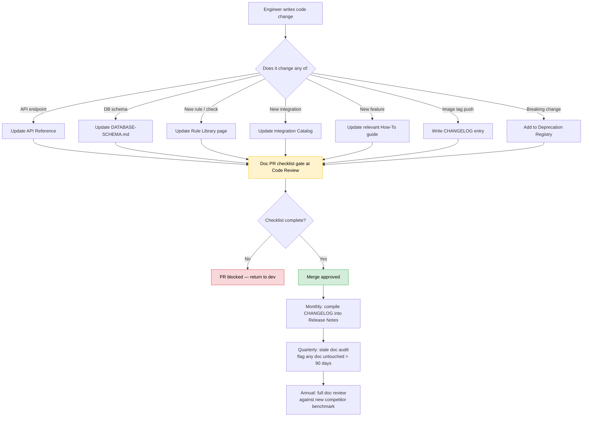
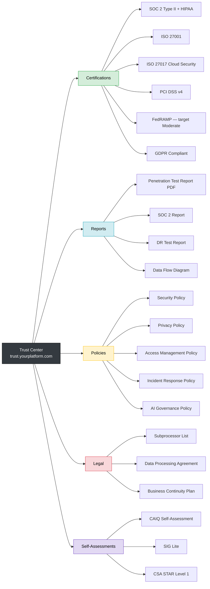
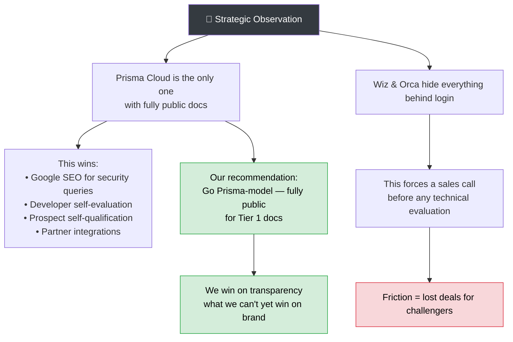

# CSPM Platform — Documentation Strategy

> **Purpose**: Defines every document type the platform should publish, audience, access tier, ownership, and how to keep it current. Benchmarked against Wiz, Orca Security, and Prisma Cloud.
> **Status**: Draft v1 — 2026-05-08
> **Decision point**: Which docs move to public portal in V1 launch

---

## 1. Documentation Ecosystem Map

The full set of docs organized by who produces them and who consumes them.

```mermaid
graph TD
    subgraph PRODUCERS["📝 Who Creates"]
        ENG[Engineering Team]
        SEC[Security Team]
        PM[Product / PM]
        DEVREL[DevRel / Tech Writer]
    end

    subgraph INTERNAL["🔒 Internal Only"]
        I1[CSPM Constitution]
        I2[Agent Binding Rules]
        I3[Database Schema]
        I4[Infrastructure Guide]
        I5[Secrets & Credentials]
        I6[Operations Runbook]
        I7[Incident Runbook]
        I8[RBAC Matrix]
        I9[Engine Prerequisite Data]
        I10[Testing & Quality Gates]
        I11[Architecture Decisions ADRs]
    end

    subgraph GATED["🔐 Login-Gated Customer Docs"]
        G1[Getting Started per CSP]
        G2[Cloud Account Onboarding]
        G3[RBAC & SSO Setup Guide]
        G4[Alert Rules & Notifications]
        G5[Compliance Report Generation]
        G6[Integration Setup Guides]
        G7[Vulnerability Management Guide]
        G8[Container & K8s Security Guide]
        G9[DSPM / Data Security Guide]
        G10[CIEM / Identity Guide]
        G11[Network Security Guide]
        G12[IaC Scanning & CI/CD Guide]
        G13[Custom Rule Authoring]
        G14[MSSP / Multi-Tenant Guide]
        G15[Release Notes Archive]
    end

    subgraph PUBLIC["🌐 Fully Public"]
        P1[Trust Center]
        P2[Public API Reference]
        P3[Rule / Policy Library]
        P4[Compliance Framework Coverage]
        P5[Architecture Overview]
        P6[Multi-CSP Onboarding Overview]
        P7[Monthly Release Notes]
        P8[Security Posture Blog / Academy]
        P9[SLA & SLO Reference]
        P10[Data Retention Policy]
        P11[Integration Catalog]
        P12[CLI Reference]
    end

    ENG --> I1 & I3 & I4 & I5 & I6 & I7 & I11
    SEC --> I2 & I8 & I10
    PM --> I9 & P9 & P10
    DEVREL --> G1 & G2 & G3 & G4 & G5 & G6 & G7 & G8 & G9 & G10 & G11 & G12 & G13 & G14
    DEVREL --> P2 & P3 & P4 & P5 & P6 & P7 & P8 & P11 & P12
    SEC --> P1

    style PUBLIC fill:#d4edda,stroke:#28a745,color:#000
    style GATED fill:#d1ecf1,stroke:#17a2b8,color:#000
    style INTERNAL fill:#f8d7da,stroke:#dc3545,color:#000
    style PRODUCERS fill:#fff3cd,stroke:#ffc107,color:#000
```

---

## 2. Publication Tier Model

Three tiers define access control. Decision rule: **if a prospect can't see it, it can't help win the deal.**

```mermaid
flowchart LR
    subgraph T1["🌐 Tier 1 — Fully Public\n(No login, indexed by Google)"]
        direction TB
        T1A["Trust Center\n(SOC2, ISO, Pentest, CAIQ)"]
        T1B["Public API Reference\n(OpenAPI/pan.dev style)"]
        T1C["Rule / Policy Library\n(1918+ rules, per CSP)"]
        T1D["Monthly Release Notes"]
        T1E["Architecture Overview"]
        T1F["Compliance Framework Matrix"]
        T1G["SLA & SLO Reference"]
        T1H["Data Retention Policy"]
        T1I["Integration Catalog"]
        T1J["CLI Reference"]
    end

    subgraph T2["🔐 Tier 2 — Customer Portal\n(Login required, active subscription)"]
        direction TB
        T2A["Per-CSP Onboarding Guides"]
        T2B["RBAC & SSO Setup"]
        T2C["Alert & Notification Config"]
        T2D["Compliance Report Generation"]
        T2E["Integration Setup Guides\n(Jira, Splunk, ServiceNow...)"]
        T2F["Vulnerability Management"]
        T2G["Container & K8s Security"]
        T2H["DSPM / Data Security"]
        T2I["CIEM / Identity Entitlement"]
        T2J["Network Security Guide"]
        T2K["IaC / CI-CD Scanning"]
        T2L["Custom Rule Authoring"]
        T2M["MSSP / Multi-Tenant"]
    end

    subgraph T3["🔒 Tier 3 — Internal Only\n(Engineering & Ops teams)"]
        direction TB
        T3A["CSPM Constitution"]
        T3B["Database Schema"]
        T3C["Infrastructure / EKS"]
        T3D["Secrets & Credentials"]
        T3E["Operations & Incident Runbooks"]
        T3F["Agent Binding Rules"]
        T3G["Testing Quality Gates"]
        T3H["Architecture Decision Records"]
    end

    T1 -->|"Converts prospects\nSEO + trust signals"| T2
    T2 -->|"Supports customers\nReduces support load"| T3

    style T1 fill:#d4edda,stroke:#28a745,color:#000
    style T2 fill:#d1ecf1,stroke:#17a2b8,color:#000
    style T3 fill:#f8d7da,stroke:#dc3545,color:#000
```

---

## 3. Competitor Benchmark — What They Publish

### 3.1 Access Model Comparison

### 3.2 Doc Type Coverage Matrix

| Doc Type | Wiz | Orca | Prisma | **Us Today** | **Gap** |
|---|:---:|:---:|:---:|:---:|---|
| Cloud onboarding per CSP | 🔐 | 🔐 | 🌐 | ❌ | Build + publish |
| Rule / policy library | 🔐 | 🔐 | 🌐 | ❌ | **High priority** |
| API reference | 🔐 | 🔐 | 🌐 | 🔒 | Make public |
| Compliance framework coverage | 🔐 | 🔐 | 🌐 | 🔒 | Make public |
| RBAC & SSO guide | 🔐 | 🔐 | 🌐 | 🔒 | Move to portal |
| Vulnerability management guide | 🔐 | 🔐 | 🌐 | ❌ | Build |
| Container & K8s security | 🔐 | 🔐 | 🌐 | ❌ | Build |
| CIEM / identity guide | 🔐 | 🔐 | 🌐 | ❌ | Build |
| DSPM / data security guide | 🔐 | 🔐 | 🌐 | ❌ | Build |
| Network security guide | 🔐 | 🔐 | 🌐 | ❌ | Build |
| IaC / CI-CD scanning guide | 🔐 | 🔐 | 🌐 | ❌ | Build |
| Custom rule authoring | 🔐 | 🔐 | 🌐 | 🔒 | Move to portal |
| Integration setup guides | 🔐 | 🔐 | 🌐 | ❌ | Build per integration |
| SIEM integration docs | 🔐 | 🔐 | 🌐 | ❌ | Build |
| Alert & notification config | 🔐 | 🔐 | 🌐 | ❌ | Build |
| **Trust Center** | **🌐** | **🌐** | partial | **❌** | **Critical gap** |
| SOC 2 Type II report | 🌐 | 🌐 | ❌ | ❌ | **Critical** |
| Pentest report (public PDF) | 🌐 | 🌐 | ❌ | ❌ | **Critical** |
| CAIQ / SIG Lite self-assessment | 🌐 | 🌐 | ❌ | ❌ | **Critical** |
| Subprocessor list | 🌐 | 🌐 | ❌ | ❌ | Required for GDPR |
| Data flow diagram | 🌐 | ❌ | ❌ | ❌ | Build |
| **Release notes (public)** | partial | 🔐 | **🌐** | **❌** | **Critical gap** |
| SLA & SLO reference | 🔐 | 🔐 | ❌ | ❌ | Build |
| Data retention policy | 🔐 | 🔐 | ❌ | ❌ | GDPR/SOC2 required |
| CLI reference | 🌐 | ❌ | 🌐 | ❌ | Build (product gap too) |
| Query language reference | ❌ | 🔐 (Sonar) | 🌐 (RQL) | ❌ | Depends on product |
| Terraform provider | ❌ | ❌ | 🌐 | ❌ | Future |
| Education / Academy content | 🌐 | partial | ❌ | ❌ | Future |
| MSSP / multi-tenant guide | 🔐 | 🔐 | 🌐 | ❌ | Build |
| Architecture overview (public) | 🔐 | 🔐 | 🌐 | 🔒 | Make public version |

**Legend**: 🌐 Public · 🔐 Login-gated · 🔒 Internal only · ❌ Does not exist

---

## 4. Priority Roadmap

---

## 5. Doc Type Taxonomy

Every document we publish belongs to one of these seven types. Knowing the type tells you who writes it, how often it changes, and who reviews it.

---

## 6. Keep-Current Model

The biggest risk for any doc program is drift between code and docs. These rules prevent it.

### Doc Ownership Table

| Doc Category | Primary Owner | Reviewer | Trigger to Update |
|---|---|---|---|
| Trust Center | Security Lead | Legal | New cert, new pentest, new policy |
| API Reference | Backend Eng | DevRel | Any endpoint change |
| Rule Library | Check Engine team | PM | Any rule add/modify/deprecate |
| Release Notes | Tech Writer / PM | Eng Lead | Every sprint / image push |
| Onboarding Guides | DevRel | Customer Success | CSP connector change |
| Feature Guides | DevRel + Engine owner | PM | Feature change |
| Integration Guides | Integrations Eng | DevRel | Integration API change |
| Architecture Overview | Architect | Eng Lead | Major design change |
| Compliance Matrix | Compliance Eng | PM | New framework, new rule |
| SLA & SLO | PM | Eng Lead | Quarterly review |
| Data Retention | Legal / PM | Security | Regulatory change |
| CHANGELOG | All engineers | — | Every image push |

---

## 7. Trust Center — Minimum Viable Contents

This is the single highest-impact doc to publish. Enterprise buyers check it before POC.

---

## 8. What We Publish in V1 (Final Decision Checklist)

Use this to make the final call on what goes live at launch.

### Tier 1 — Must publish publicly at V1 launch

- [ ] **Trust Center** — SOC2 report, pentest report, CAIQ, subprocessors, data flow diagram
- [ ] **Data Retention Policy** — required for GDPR, asked by every enterprise
- [ ] **SLA & SLO Reference** — scan frequency, findings-to-UI SLA, uptime target
- [ ] **Monthly Release Notes** — V1 format, public, starting from first GA release
- [ ] **Architecture Overview** — high-level, how data flows from cloud to findings to UI
- [ ] **Public API Reference** — expose the FastAPI OpenAPI JSON or publish to developer portal
- [ ] **Compliance Framework Coverage** — table of all 13+ frameworks with rule counts per CSP
- [ ] **Rule / Policy Library** — every check rule as a browsable public page (1918+ rules)

### Tier 2 — Customer portal at V1 launch

- [ ] **Per-CSP Onboarding Guide** — AWS, Azure, GCP, OCI, AliCloud, IBM
- [ ] **RBAC & SSO Setup Guide**
- [ ] **Alert Rules & Notifications Guide**
- [ ] **Vulnerability Management Guide**
- [ ] **Container & K8s Security Guide**
- [ ] **CIEM / Identity Entitlement Guide**
- [ ] **DSPM / Data Security Guide**
- [ ] **Network Security Guide**
- [ ] **IaC Scanning & CI-CD Integration Guide**
- [ ] **Integration Guides** — Jira, Slack, Splunk, PagerDuty (at minimum)

### Tier 3 — Post-V1 (Depth & Differentiation)

- [ ] CLI Reference (requires CLI product to exist first)
- [ ] Query Language Reference (requires investigation query feature)
- [ ] Custom Rule Authoring Guide (public version)
- [ ] MSSP / Multi-Tenant Guide
- [ ] Terraform Provider Reference
- [ ] Education / Academy Content
- [ ] CHANGELOG.md (internal first, surface publicly later)

---

## 9. Key Competitive Insight

---

*Last updated: 2026-05-08 | Status: Draft v1 — pending final V1 launch decision*
*Benchmarked against: Wiz (docs.wiz.io), Orca (docs.orcasecurity.io), Prisma Cloud (docs.prismacloud.io, pan.dev)*
