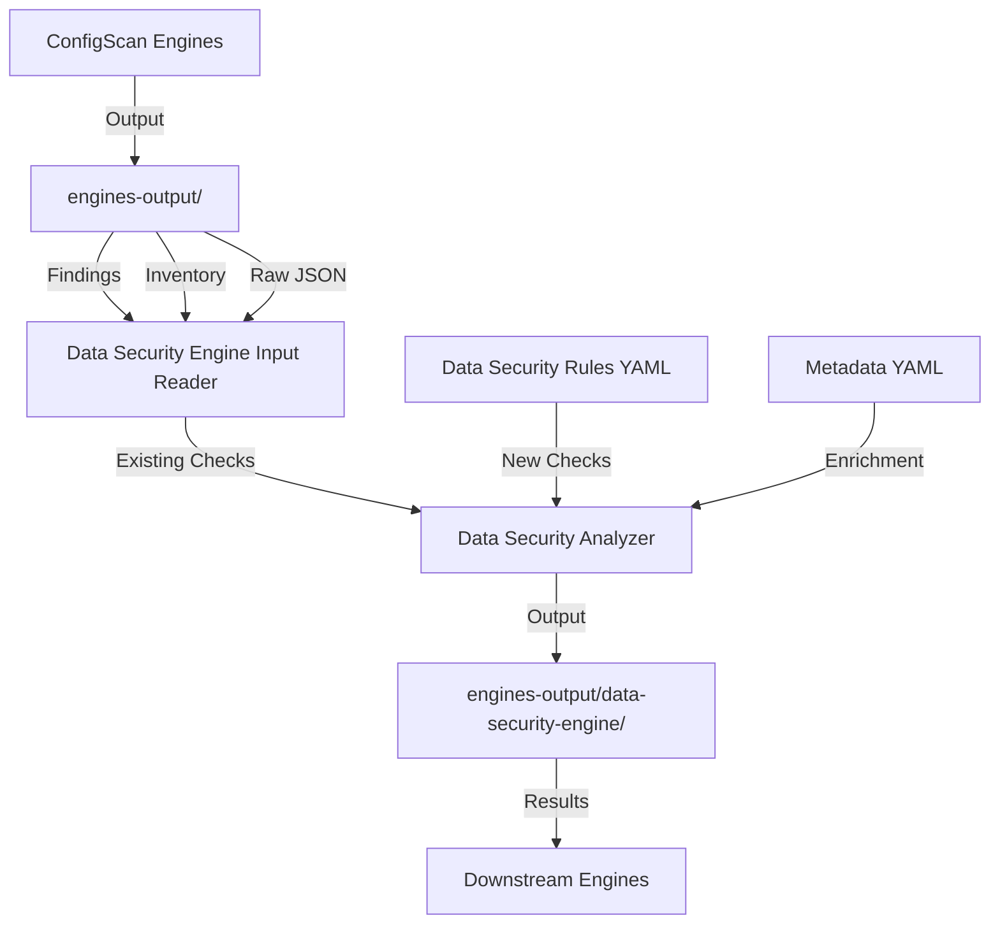

# Data Security Engine - Dependencies & Integration

## Understanding ConfigScan Engine Structure

### ConfigScan Engine Pattern

Each CSP configScan engine follows this structure:

```
configScan_engines/{csp}-configScan-engine/
├── services/
│   ├── {service}/              # e.g., s3, rds, dynamodb
│   │   ├── rules/
│   │   │   └── {service}.yaml  # Discovery operations + check logic
│   │   ├── metadata/
│   │   │   └── {rule_id}.yaml  # Rule metadata (requirement, compliance, remediation)
│   │   └── metadata_mapping.json  # Technical API mappings
```

**Key Components:**

1. **Rules YAML** (`rules/{service}.yaml`):
   - **Discovery sections**: Define boto3 API calls to discover resources
   - **Checks sections**: Define validation logic based on discovered data
   - Example: `aws.s3.list_buckets` → check encryption status

2. **Metadata YAML** (`metadata/{rule_id}.yaml`):
   - Rule description, rationale
   - Compliance mappings (GDPR, NIST, ISO27001, etc.)
   - Remediation steps
   - Severity, scope, domain

3. **Output Location**: `engines-output/{csp}-configScan-engine/output/{scan_id}/`
   - `results.ndjson` - Check results (cspm_finding.v1)
   - `inventory_*.ndjson` - Asset inventory (cspm_asset.v1)
   - `raw/{provider}/{account}/{region}/{service}.json` - Raw API responses

## Data Security Engine Integration Model

### Hybrid Approach: Producer + Consumer

Data-security-engine should:

1. **Consume ConfigScan Output** (Consumer)
   - Read from `engines-output/{csp}-configScan-engine/output/`
   - Leverage existing data-related checks (S3 encryption, RDS encryption, etc.)
   - Use inventory to identify data stores

2. **Have Own YAML Rules** (Producer)
   - Follow configScan pattern with `services/` folder
   - Data-specific checks not covered by configScan:
     - Data classification rules (PII, PCI, PHI detection)
     - Data lineage tracking rules
     - Data residency policy checks
     - Data activity anomaly detection
   - Each check has its own metadata file

### Proposed Structure

```
data-security-engine/
├── services/
│   ├── data_classification/
│   │   ├── rules/
│   │   │   └── data_classification.yaml
│   │   ├── metadata/
│   │   │   ├── data.classification.s3_pii_detected.yaml
│   │   │   ├── data.classification.rds_pci_detected.yaml
│   │   │   └── ...
│   │   └── metadata_mapping.json
│   ├── data_lineage/
│   │   ├── rules/
│   │   │   └── data_lineage.yaml
│   │   ├── metadata/
│   │   │   ├── data.lineage.s3_to_redshift_tracked.yaml
│   │   │   └── ...
│   │   └── metadata_mapping.json
│   ├── data_residency/
│   │   ├── rules/
│   │   │   └── data_residency.yaml
│   │   ├── metadata/
│   │   │   ├── data.residency.cross_border_transfer.yaml
│   │   │   └── ...
│   │   └── metadata_mapping.json
│   └── ...
├── data_security_engine/
│   ├── input/
│   │   └── configscan_reader.py    # Reads configScan output
│   ├── engine/
│   │   ├── service_scanner.py      # Scans data-security rules (like configScan)
│   │   └── main_scanner.py         # Main orchestrator
│   └── ...
└── engines-output/
    └── data-security-engine/
        └── output/
            └── {scan_id}/
                ├── results.ndjson
                ├── inventory.ndjson
                └── raw/
```

## Integration Flow



## Key Questions to Answer

### 1. Which Checks Need New YAML Rules?

**Data-specific checks that configScan doesn't cover:**

- **Classification**: Detect PII/PCI/PHI in actual data content (configScan only checks encryption/config)
- **Lineage**: Track data flows across services (not a configCheck, but a relationship analysis)
- **Residency**: Policy-based checks for geographic constraints (policy enforcement, not just config)
- **Activity Monitoring**: Anomaly detection based on logs (analysis, not config)

**Checks that can use ConfigScan output:**

- Encryption status → Read from configScan findings
- Access policies → Read from configScan findings
- Public access → Read from configScan findings

### 2. Should Data-Security-Engine Be a Full Engine?

**Option A: Full Engine with YAML Rules** (Recommended)
- Has its own `services/` folder with YAML rules
- Can be triggered independently or after configScan
- Follows same pattern as configScan engines
- Pros: Consistency, extensibility, independent scanning
- Cons: More complex, needs rule management

**Option B: Pure Consumer** (Like threat-engine)
- Only reads configScan output
- Python-based analysis only
- Pros: Simpler, leverages existing scans
- Cons: Limited to what configScan discovers

**Recommendation: Option A** - Data-security should be a full engine with YAML rules for data-specific checks, while also consuming configScan output for foundational checks.

## Example: Data Classification Rule

### Rules YAML (`services/data_classification/rules/data_classification.yaml`)

```yaml
version: '1.0'
provider: aws
service: data_classification
services:
  client: s3
  module: boto3.client
discovery:
  # Use configScan inventory to find S3 buckets
  - discovery_id: aws.data.s3_buckets_from_inventory
    # Read from configScan output
    source: configscan_inventory
    filter:
      resource_type: s3:bucket
    emit:
      items_for: '{{ inventory.items }}'
      as: item
      item:
        BucketName: '{{ item.resource_id }}'
        ResourceArn: '{{ item.resource_arn }}'
  
  # Sample objects for classification
  - discovery_id: aws.data.s3_object_samples
    calls:
    - action: list_objects_v2
      save_as: response
      params:
        Bucket: '{{ item.BucketName }}'
        MaxKeys: 10  # Sample for performance
      for_each: aws.data.s3_buckets_from_inventory
      on_error: continue
    emit:
      items_for: '{{ response.Contents }}'
      as: obj
      item:
        BucketName: '{{ item.BucketName }}'
        Key: '{{ obj.Key }}'

  # Get object content for classification
  - discovery_id: aws.data.s3_object_content_sample
    calls:
    - action: get_object
      save_as: response
      params:
        Bucket: '{{ item.BucketName }}'
        Key: '{{ item.Key }}'
        Range: 'bytes=0-1024'  # Sample first 1KB
      for_each: aws.data.s3_object_samples
      on_error: continue
    emit:
      item:
        BucketName: '{{ item.BucketName }}'
        Key: '{{ item.Key }}'
        Content: '{{ response.Body.read().decode("utf-8", errors="ignore") }}'

checks:
  - rule_id: data.classification.s3_pii_detected
    for_each: aws.data.s3_object_content_sample
    conditions:
      # Check for PII patterns (SSN, email, etc.)
      any:
      - var: item.Content
        op: matches_regex
        value: '\b\d{3}-\d{2}-\d{4}\b'  # SSN pattern
      - var: item.Content
        op: matches_regex
        value: '\b[A-Za-z0-9._%+-]+@[A-Za-z0-9.-]+\.[A-Z|a-z]{2,}\b'  # Email
```

### Metadata YAML (`services/data_classification/metadata/data.classification.s3_pii_detected.yaml`)

```yaml
rule_id: data.classification.s3_pii_detected
service: data_classification
resource: s3_object
requirement: PII Data Detection
title: S3 bucket contains personally identifiable information (PII)
scope: data.classification.pii_detection
domain: data_security
subcategory: data_classification
rationale: PII in unencrypted or publicly accessible S3 buckets violates GDPR, CCPA, and other privacy regulations. Organizations must identify and protect PII data.
severity: high
compliance:
  - gdpr_article_32_encryption_requirement
  - ccpa_data_protection_requirement
  - hipaa_phi_protection_requirement
description: |
  Detects personally identifiable information (PII) in S3 objects by scanning
  object content for patterns matching SSNs, email addresses, credit card numbers,
  and other sensitive data indicators.
references:
  - https://docs.aws.amazon.com/AmazonS3/latest/userguide/s3-security-best-practices.html
remediation: |
  If PII is detected:
  1. Encrypt the S3 bucket using KMS encryption
  2. Restrict bucket access using IAM policies
  3. Enable bucket versioning and logging
  4. Consider using AWS Macie for automated PII detection
  5. Review data retention policies
```

## Implementation Strategy

### Phase 1: Consumer Mode (Read ConfigScan Output)
- Build input reader to consume configScan findings/inventory
- Identify data stores from configScan inventory
- Use existing encryption/access checks from configScan

### Phase 2: Add YAML Rules for Data-Specific Checks
- Create `services/data_classification/` structure
- Implement classification rules (PII, PCI, PHI patterns)
- Create corresponding metadata files
- Follow configScan engine pattern for consistency

### Phase 3: Expand to Other Data Modules
- Data lineage rules
- Data residency rules
- Activity monitoring rules

## Questions for User

1. **Should data-security-engine have its own YAML rules structure** like configScan engines?
   - YES: Full engine with `services/` folder
   - NO: Pure consumer, Python-only analysis

2. **Which data-specific checks need new YAML rules?**
   - Classification (PII/PCI/PHI detection)?
   - Lineage tracking?
   - Residency policy enforcement?
   - Activity anomaly detection?

3. **Should it reuse configScan's discovery** or have its own?
   - Reuse: Read from configScan inventory
   - Own: Duplicate discovery in YAML rules

## Recommendation

**Follow the configScan pattern**: Data-security-engine should be a full engine with:
- `services/` folder structure with YAML rules
- Metadata files for each rule
- Ability to consume configScan output for foundational checks
- Own discovery/checks for data-specific features

This provides:
- Consistency with existing engine architecture
- Extensibility for new data security checks
- Reusability of configScan findings
- Proper compliance metadata tracking


